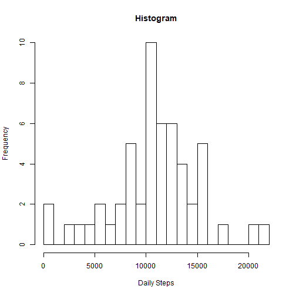
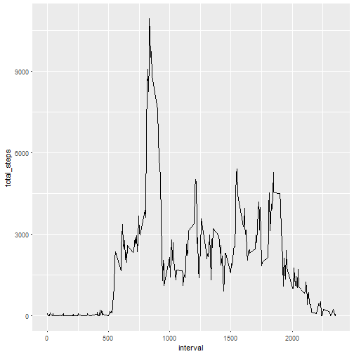
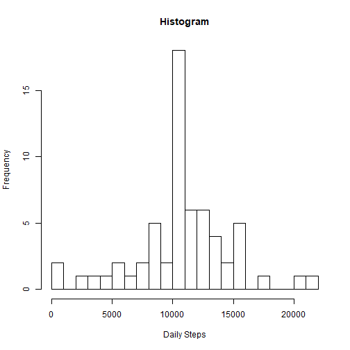
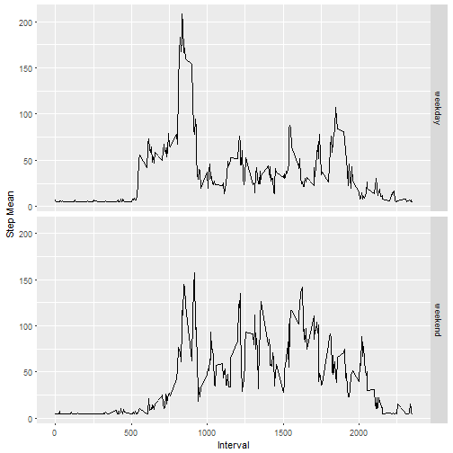

## Loading and preprocessing the data


```r
library(ggplot2)
library(dplyr)
library(knitr)
```

#### 1. Code for reading in the dataset and/or processing the data


```r
download.file("https://d396qusza40orc.cloudfront.net/repdata%2Fdata%2Factivity.zip", destfile = "activity.zip")
unzip("activity.zip")
dataset <- read.table("activity.csv", header = TRUE, sep = ",")
```

-----

## What is mean total number of steps taken per day?


#### 2. Histogram of the total number of steps taken each day


```r
StepsByDay <- dataset %>% select(date, steps) %>% group_by(date)  %>% summarize(total_steps = sum(steps)) %>% na.omit()
hist(StepsByDay$total_steps, xlab = "Daily Steps",main="Histogram", breaks = 20)
```



-----

## What is the average daily activity pattern?


#### 3. Mean and median number of steps taken each day


Mean


```r
mean(StepsByDay$total_steps)
```

```
## [1] 10766.19
```

Median


```r
median(StepsByDay$total_steps)
```

```
## [1] 10765
```


#### 4. Time series plot of the average number of steps taken


```r
StepsByInterval <- dataset %>% select(interval, steps) %>% na.omit() %>% group_by(interval) %>% summarize(total_steps = sum(steps))

ggplot(StepsByInterval, aes(x = interval, y = total_steps)) + geom_line()
```




#### 5. The 5-minute interval that, on average, contains the maximum number of steps


```r
StepsByInterval[which(StepsByInterval$total_steps == max(StepsByInterval$total_steps)),]
```

```
## # A tibble: 1 x 2
##   interval total_steps
##      <int>       <int>
## 1      835       10927
```

Most steps on average at 8:35.

-----

## Imputing missing values


#### 6. Code to describe and show a strategy for imputing missing data


```r
length(which(is.na(dataset$steps)))
```

```
## [1] 2304
```

Imputing with mean values.


```r
mean_steps <- mean(dataset$steps, na.rm = TRUE)
imputed_dataset <- dataset %>% replace(., is.na(.), mean_steps)
```

Are there NA's?


```r
sum(is.na(imputed_dataset) ) > 0
```

```
## [1] FALSE
```


#### 7. Histogram of the total number of steps taken each day after missing values are imputed


```r
StepsByDay_imputed <- imputed_dataset  %>% group_by(date)  %>% summarize(total_steps = sum(steps)) %>% na.omit()
hist(StepsByDay_imputed$total_steps, xlab = "Daily Steps",main="Histogram", breaks = 20)
```



Mean


```r
mean(StepsByDay_imputed$total_steps)
```

```
## [1] 10766.19
```

Median


```r
median(StepsByDay_imputed$total_steps)
```

```
## [1] 10766.19
```

Mean and median do not differ from the old ones.

-----

## Are there differences in activity patterns between weekdays and weekends?


#### 8. Panel plot comparing the average number of steps taken per 5-minute interval across weekdays and weekends


Creating a weekday variable


```r
imputed_dataset$date <- as.Date(imputed_dataset$date)
imputed_dataset$weekday <- weekdays(imputed_dataset$date)
imputed_dataset$weekend <- ifelse(imputed_dataset$weekday=="lauantai" | imputed_dataset$weekday=="sunnuntai", "weekend", "weekday" )
```

Creating the plots


```r
averaged_imputed_dataset <- aggregate(imputed_dataset$steps, by = list(imputed_dataset$weekend, imputed_dataset$interval), mean)

ggplot(averaged_imputed_dataset, aes(x=Group.2, y = x)) + geom_line()+
facet_grid(Group.1 ~.) + xlab("Interval") + ylab("Step Mean")
```


